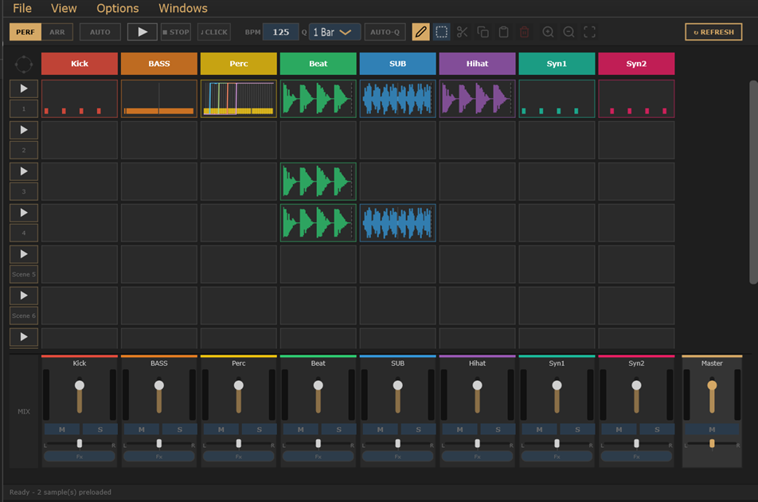
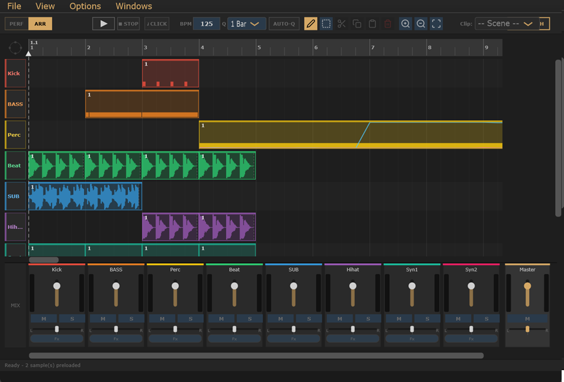

# Live Performance & Arrangement View -- User Manual

The **Live Performance / Arrangement** view is the main session window. It has two modes that share the same toolbar and mixer strip:

- **Performance Mode** -- a scene/clip grid for live triggering and composition.
- **Arrangement Mode** -- a time-based timeline for arranging clips into a linear song.

Switch between modes using the **PERF | ARR** toggle at the left of the toolbar.

---

## Layout Overview



```
+--------------------------------------------------------------+
| Toolbar  [mode][AUTO][Play][Stop][Click][BPM][Q][AutoQ]...  |
+------+--------+--------+--------+------------------------+--+
|      | T1     | T2     | T3     |      ...               |  |
| Scn  +--------+--------+--------+                        |V |
|  1   | clip   | clip   | clip   |  (tracks scroll right) |S |
+------+--------+--------+--------+                        |B |
| Scn  | clip   | clip   | clip   |                        |  |
|  2   |        |        |        |                        |  |
+------+--------+--------+--------+------------------------+--+
|  [+] |                                 H Scrollbar          |
+------+------ Mixer strip -------------------------+----------+
|      | Vol Pan M S Fx | Vol Pan M S Fx | ...      | Master  |
+------+-------------------------------------------------+----+
| Status bar                                              |    |
+----------------------------------------------------------+---+
```

In **Arrangement Mode** the grid is replaced by a horizontal timeline:



```
+------+------- Time ruler (bar numbers, beat ticks) ----------+
| T1   | [waveform clip][   clip   ]     [clip]                |
| T2   |      [clip]                  [clip][clip]             |
| T3   |                                                       |
+------+-------------------------------------------------------+
```

---

## Toolbar

Buttons appear left to right in the toolbar.

---

### PERF | ARR (Mode Toggle)

A button split into two halves:

| Half | Action |
|---|---|
| **PERF** (left) | Switch to Performance Mode (clip grid) |
| **ARR** (right) | Switch to Arrangement Mode (timeline) |

The active mode half is highlighted. Switching modes stops any current playback and resets the scroll position.

---

### AUTO (Auto-Advance)

Available in **Performance Mode** only. When active (gold background), the scene sequencer plays all scenes in order from top to bottom, advancing at each scene's natural end. When auto-advance is active:

- The **Play** button (or **Space**) starts playback from Scene 1.
- Clicking a scene button jumps to and starts that scene.
- Individual clip cell triggers are disabled.

When AUTO is off, clips are triggered freely per track.

---

### Play

Starts playback. Behavior depends on the current state:

| State | Action |
|---|---|
| Performance Mode, AUTO off | Starts the live transport; clips play when triggered |
| Performance Mode, AUTO on | Starts scene auto-advance from Scene 1 |
| Arrangement Mode | Pre-renders all sample tracks and starts the arrangement timeline |
| Editor overlay open | Starts single-clip preview from the seek cursor |

If transport is already running, Play does nothing.

---

### Stop

Stops all playback immediately. Clears the playhead. Queued and playing clips are stopped.

---

### Metronome (Click)

Toggles the click track on/off. When active (gold background), the metronome generates a beat on every quarter note at the current project tempo.

---

### BPM (Tempo)

An editable field showing the current project BPM (20-300). Double-click to edit; press Enter or click away to commit. Changes are applied immediately. Integer values only.

---

### Q (Global Quantize)

Sets the **launch quantise** for all clips that use "Inherit":

| Option | Meaning |
|---|---|
| **1/16** | Clips start on the next 1/16th note |
| **1/4** | Clips start on the next beat |
| **1/2** | Clips start on the next half-bar |
| **1 Bar** | Clips start on the next bar (default) |

Also determines the snap grid in **Arrangement Mode** for clip placement and paste cursor positioning.

---

### Auto-Q (Auto-Quantize)

When active (gold background), audio files dropped onto the grid are automatically:

1. BPM-detected from the filename or embedded metadata.
2. Time-stretched to match the project tempo.
3. Clip length snapped to the nearest bar count.

When off, files are loaded as-is at their original tempo.

---

### Pencil (Draw Mode)

Activates **Draw / Pencil mode** (the default). Pencil is shown as active (gold background) when SEL is not on. In this mode:

- **Performance Mode**: clicking a clip cell opens the editor (transport off) or triggers the clip (transport on).
- **Arrangement Mode**: clicking a track's timeline row places a clip at that position.

---

### SEL (Select Mode)

Activates **Select Mode**. Behavior depends on context:

| Context | Effect |
|---|---|
| **Clip Editor overlay** | Activates rubber-band note selection in the piano roll |
| **Sample Editor overlay** | Activates waveform range selection |
| **Performance grid** | Click a cell, scene button, or track header to select it (purple highlight) |
| **Arrangement timeline** | Click a clip to select it (purple highlight); Ctrl+click for multi-selection |

When SEL is active, Cut / Copy / Paste / Clear / Label operate on the current selection.

---

### Cut (Scissors icon)

Cuts the current selection to the clipboard. Context-aware:

- **Piano Roll**: cuts selected notes.
- **Sample Editor**: cuts the selected waveform region.
- **Arrangement** (SEL + clips selected): removes selected clips from the timeline and stores them for paste.
- **Performance grid** (SEL + selection): cuts the selected clip, scene, or track.

---

### Copy

Copies the current selection to the clipboard without removing it. Same context rules as Cut.

---

### Paste

Pastes the clipboard contents. In **Arrangement Mode**, clips are placed starting at the paste cursor (white dashed line), so that the earliest clip in the clipboard lands at the cursor position.

---

### Clear (Trash icon)

Removes the current selection. Context-aware:

| Context | Action |
|---|---|
| Clip Editor, notes selected | Deletes selected notes |
| Sample Editor, region selected | Silences the selected region |
| Arrangement, clips selected | Deletes selected arranged clips |
| Arrangement, track selected (no clips) | Confirmation dialog: removes all clips from that track's timeline |
| Performance grid, selection | Confirmation dialog or immediate delete |

---

### LBL (Label)

Opens a text dialog to label the selected item. Context-aware:

| Context | What is labelled |
|---|---|
| Clip / Sample Editor open | Labels the clip currently open in the editor |
| Arrangement Mode | If the paste cursor is inside an existing section marker: edits that marker's label. Otherwise creates a new section marker at the cursor spanning one bar. |
| Performance SEL + clip selected | Labels the selected clip cell |

Labels appear in **gold** on the clip thumbnail. Unlabelled clips show the scene name in white.

---

### WIZ (Arrangement Wizard)

Available in **Arrangement Mode** only. Opens the **Arrangement Wizard** dialog, which lets you describe an entire song arrangement as a text formula and apply it in one step.

> See **[docs/ArrangementFormula.md](ArrangementFormula.md)** for the full syntax reference.

---

### Zoom In / Zoom Out / Zoom Fit

Horizontal zoom controls. Behavior depends on context:

| Context | Action |
|---|---|
| **Clip Editor overlay** | Zooms the piano roll |
| **Sample Editor overlay** | Zooms the waveform |
| **Arrangement Mode** | Zooms the timeline, pivoting around the cursor |
| **Performance Mode** | Not active (the performance grid has fixed cell sizes) |

**Zoom Fit** in Arrangement Mode adjusts the zoom to show all placed clips within the visible width and resets the scroll to bar 1.

---

### Refresh (far right)

Forces the grid to reload the latest state from the project. Use this after making changes in a sub-dialog that did not automatically refresh the display.

---

## Performance Mode

### Grid Structure

```
+------+--------+--------+--------+
|      | T1     | T2     | T3     |  <- Track headers
+------+--------+--------+--------+
| S1 ^ | clip   | clip   | clip   |  <- Scene 1
+------+--------+--------+--------+
| S2 ^ |        | clip   |        |  <- Scene 2
+------+--------+--------+--------+
| [+]  |                           |  <- Add Scene button
```

- **Track headers** (top row, one column per track): show the track name with a coloured left-edge stripe. Click to open Track Properties.
- **Scene buttons** (left column): each scene row has a play/properties button. Click the top half to launch the scene; click the bottom half for scene properties.
- **Clip cells**: show a waveform preview (audio clips) or a note preview (MIDI clips).
- **+ Track** button adds a new track column. Maximum 12 tracks.
- **+ Scene** button adds a new scene row. Maximum 20 scenes.

---

### Scene Buttons

Each scene button is split vertically:

| Half | Action |
|---|---|
| **Top half** (play triangle) | Launches all clips in this scene (stops clips from other scenes first). Starts transport if not running. |
| **Bottom half** (properties) | Opens the Scene Properties dialog. |
| **Right-click** | Opens the scene context menu. |

**Auto-advance**: when AUTO is on, clicking the top half starts auto-advance from that scene.

---

### Clip Cells

| Interaction | Transport off | Transport on |
|---|---|---|
| **Single click** | Opens the Clip Editor (MIDI/drum) or Sample Editor (audio) | Triggers / toggles the clip (queued, then starts at the next quantise boundary) |
| **Double-click** | Opens the editor | Opens the editor |
| **Right-click** | Context menu | Context menu |
| **Drag to another cell** | Copies the clip to the destination (cross-type drags rejected) | -- |
| **Drag to trash zone** (above master fader) | Clears the clip | -- |

**Clip state colours:**

| State | Visual |
|---|---|
| Empty | Dark, dim |
| Has content | Coloured (waveform or note preview) |
| Playing | Bright with a green playhead line |
| Queued to start | Dimmer gold ring |
| Queued to stop | Red border |

---

### Track Headers

| Interaction | Action |
|---|---|
| **Left-click** | Opens Track Properties dialog |
| **Right-click** | Opens track context menu (rename, type, clone, delete, clear track) |

---

### Scene Properties Dialog

Right-click a scene button and choose Properties, or click its bottom half.

| Field | Description |
|---|---|
| Scene Name | Text name for this scene |
| Quantize | Per-scene launch quantise (Inherit / 1/16 / 1/4 / 1/2 / 1 Bar) |
| Fade In | Cross-fades this scene in from the previous one |
| Fade Out | Cross-fades this scene out into the next one |
| Move Up / Move Down | Reorders scenes in the grid |
| Clone | Duplicates this scene (all clips and settings) below it |
| Delete | Removes the scene (confirmation required) |
| Clear All Clips | Empties every clip cell in this scene (confirmation required) |

---

### Track Properties Dialog

Left-click a track header.

| Field | Description |
|---|---|
| Name | Text name for the track |
| Track Type | Sample, Melody (VST), Drum Kit, Sampled Instrument |
| Playback Mode | Loop or One-shot |
| VST Instrument | (Melody tracks only) searchable list of loaded plugins |
| MIDI Device / Channel | (Melody tracks) MIDI input routing |
| Remap C Major | (Melody tracks) maps incoming MIDI notes from C major to the track's target scale |
| Move Left / Move Right | Reorders the track |
| Clone | Duplicates the track and all its clips |
| Delete | Removes the track and all its clips (confirmation required) |
| Clear Track | Clears all clip cells for this track (confirmation required) |

---

### File Drag & Drop (Performance Mode)

Drag audio files (WAV, AIF, AIFF, MP3, OGG, FLAC) from Explorer onto clip cells:

- **Single file**: loads into the target cell. A wait cursor is shown during load.
- **Multiple files**: the first file goes into the target cell; subsequent files fill consecutive scenes downward in the same track column.
- **Auto-Q**: if enabled and the file has a detectable BPM (from its filename or embedded metadata), the file is time-stretched to the project tempo and the clip length snapped to the nearest bar.
- **Cross-type rejection**: audio files on MIDI tracks (and vice versa) are rejected with a status message.

---

## Arrangement Mode

### Timeline Layout

```
+------+---- Time ruler ----+------------------------------------+
|      | 1    2   3    4    | 5  6    7    8                     |
| T1   | [Verse clip.....] | [Chorus clip....]                  |
| T2   | [..bass line.....] |                 [break...]         |
| T3   |         [pad...]   |                                    |
+------+----------------------------------------------------+----+
```

- **Track labels** (left column): show the track name with a coloured stripe. Click to select the track for clip painting.
- **Time ruler** (top): bar numbers and beat ticks. Click or drag to position the paste cursor.
- **Section marker bands**: coloured regions in the ruler for named song sections (Intro, Verse, Chorus, etc.).
- **Clip blocks**: placed clips showing a waveform or note preview.

---

### Visual Indicators

| Element | Colour | Meaning |
|---|---|---|
| Playhead | Green line + downward triangle | Current playback position |
| Paste cursor | White dashed line + upward triangle | Where the next clip placement or paste will land |
| Cursor position label | White, small, beside triangle | Bar.Beat position (e.g. "4.3") |
| Selected clip | Purple fill + border | Clip is in the current selection |
| Section markers | Steel blue / olive / muted red / amber / purple / teal | Named song sections in the ruler |
| Q snap highlight | Purple band in ruler | Snap zone for the current quantize grid (SEL mode) |

---

### Placing Clips (Draw / Pencil Mode)

1. Click a **track label** on the left to select that track. The **Scenes** combo in the toolbar updates to show all available clips for that track.
2. Use the **Scenes** combo to choose which scene's clip to paint.
3. **Left-click** anywhere in that track's timeline row to place a clip at the clicked position, snapped to the current Q grid.
4. **Left-click and drag** to paint multiple clip instances across a range (each empty Q-grid slot gets a copy).
5. **Right-click** a placed clip to erase it.

Clip placement is rejected if it would overlap an existing clip on the same track.

---

### Moving and Resizing Clips

| Interaction | Action |
|---|---|
| **Drag clip body** | Moves the clip to a new bar position (snapped to Q grid) |
| **Drag right edge** | Shortens the clip's active length (cannot exceed the source clip's original length, and cannot extend past the next clip on the same track) |
| **Right-click** | Removes the clip from the timeline |
| **Double-click** | Opens the Clip Editor or Sample Editor for that clip |

---

### Paste Cursor

The white dashed line is the paste cursor. It determines where **Paste** (Ctrl+V) places copied clips, and where the **LBL** button creates or edits a section marker.

- **Click** anywhere in the grid or ruler to reposition the cursor (snapped to Q grid).
- **Drag** in the ruler to scrub the cursor position.

---

### Section Markers

Section markers are labelled bands in the ruler that span one or more bars, giving you a visual map of the song structure.

| Action | How to do it |
|---|---|
| Add marker | Position the paste cursor at the desired bar, then click **LBL**. A new 1-bar marker is created if no existing marker contains the cursor. |
| Edit label | Double-click an existing marker band in the ruler, or position the cursor inside it and click **LBL**. |
| Remove marker | Edit the label to blank and save. |

**Marker colours** (assigned in sequence, cycling if you add more than 6):

| Colour | Typical use |
|---|---|
| Steel blue | Intro, Outro |
| Olive green | Verse, Break |
| Muted red | Chorus, Drop |
| Amber | Buildup, Bridge |
| Purple | Pre-chorus, Transition |
| Teal | Outro B |

---

### Selecting Clips (Arrangement SEL Mode)

When **SEL** is active in Arrangement Mode:

- **Click** a clip: selects it (purple highlight). Previous selection is cleared.
- **Ctrl+click**: adds or removes the clip from the selection without clearing others.
- **Click empty space**: clears the selection.
- **Click track label**: selects the whole track. Delete / Clear will then target all clips in that track's timeline.

---

### Arrangement Playback

1. Click **Play** (or press **Space**). A brief wait cursor appears while sample tracks are prepared.
2. The green playhead advances left to right across the timeline.
3. The arrangement ends automatically when the playhead passes the last placed clip.
4. **Stop** (or **Space**) halts the playhead immediately.

---

### Zoom in Arrangement Mode

| Action | Result |
|---|---|
| **Ctrl + scroll wheel** | Zoom in / out, pivoting around the mouse position |
| **Scroll wheel** | Scroll the timeline left / right |
| **Zoom In button** | Zoom in |
| **Zoom Out button** | Zoom out |
| **Zoom Fit button** | Fit all placed clips into the visible width |

The timeline spans a total of **128 bars**. The zoom range goes from a full-overview (all 128 bars visible) down to a very close view for precise editing.

---

## Mixer Strip

The mixer strip is always visible below the clip grid.

### Per-Track Channel Strip

Each track has (left to right):

| Control | Description |
|---|---|
| **Level meters** (L/R) | Real-time peak meters |
| **Volume fader** | Track output level (0-100%) |
| **Pan slider** | Stereo panning. Drag left/right. Double-click to reset to centre. |
| **M (Mute)** | Mutes the track |
| **S (Solo)** | Solos the track (all others are muted) |
| **Fx** | Opens the FX Chain editor for this track |

### Master Channel

The rightmost strip:

| Control | Description |
|---|---|
| **Level meters** (L/R) | Master output meters |
| **Master Fader** | Master output volume |
| **Master Pan** | Master output pan |
| **M (Mute)** | Mutes master output |
| **Fx** | Opens the master FX chain |

The **trash drop zone** appears above the master fader while you are dragging a clip cell -- drop a clip here to clear it.

In **Arrangement Mode**, the mixer strip can be scrolled horizontally independently of the timeline using Shift+Scroll or the mixer scrollbar.

---

## Status Bar

The status bar at the bottom of the view shows the current state:

| State | Colour | Example |
|---|---|---|
| Idle / ready | Dim | "Ready" |
| Loading | Yellow/gold | "Preloading 5 sample(s)..." |
| Processing multiple files | Red | "Processing 3 files..." |
| Playing (performance) | Dim | "Playing" or "Scene 3" |

---

## Keyboard Shortcuts

| Key | Action |
|---|---|
| **Space** | Play / Stop |
| **Ctrl+X** | Cut (applies to current selection context) |
| **Ctrl+C** | Copy |
| **Ctrl+V** | Paste (at paste cursor in arrangement; after last note in piano roll) |
| **Ctrl+D** | Duplicate selected clips (Arrangement SEL mode only) |
| **Delete** or **Backspace** | Delete selection (notes, waveform region, or arranged clips) |

---

## Clip Thumbnails

Clips show a preview inside their cell or timeline block:

| Content | Preview type |
|---|---|
| Audio clip | Waveform preview (track colour) |
| MIDI clip | Note bars -- a mini piano roll (track colour) |
| Automation | Thin coloured lines per parameter overlaid on the clip |

Labels assigned with the **LBL** button appear in **gold** in the top-left of the clip. Unlabelled clips show the scene name in white.

---

## Tips

- Use **Auto-Advance** to rehearse a full song in order without manual intervention. Click any scene button during auto-advance to skip directly to that scene.
- In **Arrangement Mode**, **Zoom Fit** is the fastest way to get an overview of the full arrangement after placing clips.
- Use **LBL** to mark Intro / Verse / Chorus / Drop etc. in the ruler; the coloured bands make navigation much easier during editing and live performance.
- The **Q combo** is the most important control in Arrangement Mode: a coarser grid (1 Bar) makes rough layout fast; switch to 1/4 or 1/16 for fine-tuned transitions.
- When placing clips with **Auto-Q on**, files detected at the same BPM as the project land exactly on the bar grid. Files at a different BPM are stretched first.
- Drag the **right edge** of an arranged clip to shorten it, creating a natural loop-end without modifying the source clip.
- **Ctrl+D** in SEL mode duplicates selected clips into the next available gap, preserving their relative offsets -- faster than Paste for extending a repeating section.
- The **Scenes** combo in Arrangement Mode remembers the last-used scene per track, so you can quickly switch between a verse and a chorus clip on the same track.

---

> See **[docs/Manual.md](Manual.md)** for the full application manual.
> See **[docs/ClipEditor.md](ClipEditor.md)** for the Piano Roll editor reference.
> See **[docs/SampleEditor.md](SampleEditor.md)** for the Sample / Waveform editor reference.
