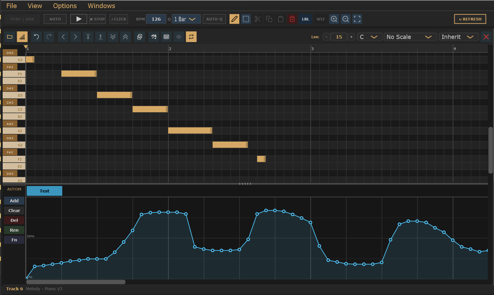

# Clip Editor (Piano Roll) -- User Manual

The **Clip Editor** is a full-overlay piano roll that opens when you double-click a clip cell in the Live Performance grid. It lets you draw, move, resize, and delete MIDI notes, control clip length and loop mode, apply scale filters, and edit per-parameter automation -- all without leaving the session.

---

## Opening and Closing

- **Open**: Double-click any clip cell in the Live Performance grid.
- **Close**: Click the **X** button at the far right of the toolbar, or click the close button in the Live Performance toolbar while the editor is showing.
- Changes are applied immediately and written to the project file on the next save.

---

## Layout



```
+-------------------------------------------------------------------+
| Toolbar  [buttons left]    [Scale] [Q combo] [Len: - N +] [X]    |
+-------------------------------------------------------------------+
| Ruler (bar/beat marks, seek triangle)                             |
+----------+--------------------------------------------------------+
|  Piano   |  Note grid (scroll, zoom, draw, move, resize)         | V
|  keys    |                                                        | S
|          |                                                        | B
+----------+--------------------------------------------------------+
| H Scrollbar                                                       |
+-----+--------- Resizable divider (drag) --------------------------+
|     | [param buttons toolbar]                                     |
|AUTO |                                                             |
|     | Automation curve (breakpoints + filled area)               |
+-------------------------------------------------------------------+
| Info bar   Track name (gold) | type - instrument (dim)  hint -->  |
+-------------------------------------------------------------------+
```

| Zone | Purpose |
|---|---|
| Toolbar | All edit buttons, playback controls, clip settings |
| Ruler | Bar/beat time axis; click or drag to set seek position |
| Piano keys | Pitch labels (or drum pad names) |
| Note grid | Note drawing, moving, resizing; rubber-band selection |
| H Scrollbar | Horizontal pan |
| Automation divider | Drag to resize the automation lane |
| Automation lane | Per-parameter breakpoint curves |
| Info bar | Track name left (gold bold), hover hint right (gold) |

---

## Toolbar Buttons -- Left Side

Buttons appear left to right in this order.

---

### Load MIDI

Opens a file browser to import notes from a `.mid` or `.midi` file. MIDI timestamps are converted to 1/16th note steps using the file's embedded tempo. The clip length is extended automatically to fit all imported notes. Hidden in **Drum Kit** mode.

---

### Automation (Toggle)

Toggles the **Automation Lane** panel at the bottom of the editor. When active (gold background), the lane is visible and automation buttons become available in the parameter panel on the left.

---

### Undo / Redo

Steps backward and forward through the note edit history. The buttons are dimmed when no undo or redo states are available. Up to 50 undo levels are stored.

- Keyboard: **Ctrl+Z** (undo), **Ctrl+Y** (redo).

---

### Nudge Left / Right / Down / Up

Moves the currently selected notes one step left/right or one semitone down/up. All four buttons are disabled when no notes are selected or when Selection mode is off.

| Button | Action | Keyboard equivalent |
|---|---|---|
| Nudge Left | -1 step | Shift+Left arrow |
| Nudge Right | +1 step | Shift+Right arrow |
| Nudge Down | -1 semitone | Shift+Down arrow |
| Nudge Up | +1 semitone | Shift+Up arrow |

---

### Octave Down / Octave Up

Transposes the selected notes down or up by 12 semitones. Disabled when no notes are selected or Selection mode is off.

- Keyboard: **Ctrl+Down** (down), **Ctrl+Up** (up).

---

### Duplicate

Copies the selected notes and pastes them after the last note in the clip, extending the pattern. Keyboard: **Ctrl+D**.

---

### Generate

Opens the **Note Generator** dialog where you can create melody, chord, or arpeggio patterns. Accepted patterns are added to the current clip and can include automation segments. Hidden in **Drum Kit** mode.

---

### VST UI

Opens the plugin editor window for the current track's VST instrument. This button is enabled only for **melody** tracks that have a loaded plugin.

---

### Hide Notes (Filter / Eye icon)

Toggles the **scale filter**. When on (gold background), only rows for pitches that belong to the selected scale (set by the Scale Root and Scale Type combos) are shown -- all other rows are hidden. When off, all rows are visible but out-of-scale rows have a slightly reddish background tint as a visual indicator.

Hidden in **Drum Kit** mode.

---

### Loop

Toggles the clip's playback mode between **Loop** (repeating) and **One-shot** (plays once and stops). When active (gold background), the clip loops continuously. This setting is stored per clip.

---

## Toolbar Controls -- Right Side

These controls appear at the right end of the toolbar, right to left.

---

### X (Close)

Closes the Clip Editor overlay and returns to the Live Performance grid.

---

### Sampler Instrument Combo + Status

Visible only for **Sampled Instrument** tracks. The combo selects the sample preset for the track. The status label shows the current load state:

- **Loading...** (animated, with a timer icon) -- preset is being loaded.
- **Ready** (green checkmark) -- preset loaded successfully, shown for a few seconds then hidden.

---

### Q (Quantize Combo)

Sets the **launch quantise** for this clip -- how precisely the clip start aligns to the beat when triggered from the Live Performance grid.

| Option | Behaviour |
|---|---|
| **Inherit** | Uses the global song quantise from the main toolbar |
| **1/16** | Clip starts on the next 1/16th note boundary |
| **1/4** | Clip starts on the next beat |
| **1/2** | Clip starts on the next half-bar |
| **1 Bar** | Clip starts on the next bar boundary |

---

### Scale Type Combo

Selects the active scale for highlighting and filtering. Available types:

No Scale, Major, Natural Minor, Harmonic Minor, Melodic Minor, Pentatonic Major, Pentatonic Minor, Blues, Dorian, Phrygian, Lydian, Mixolydian, Locrian, Chromatic.

Hidden in **Drum Kit** mode.

---

### Scale Root Combo

Sets the root note of the active scale (C through B). Combined with Scale Type, this determines which rows are highlighted gold and which are shown/hidden by the filter. Hidden in **Drum Kit** mode.

---

### Len: -- N -- + (Clip Length)

Sets the **clip length in bars**.

| Control | Action |
|---|---|
| **-** button | Decrease length by 1 bar |
| **N** (value label) | Shows current bar count. Double-click to type a value directly (1-256 bars). |
| **+** button | Increase length by 1 bar |

Audio to the right of the clip boundary is dimmed in the grid. The scrollbar range updates when the length changes.

---

## Piano Key Panel

The panel on the left side of the editor.

### Melody / Sampler mode

Displays 50 notes spanning from B0 upwards, drawn as a standard piano keyboard:

- **White keys in scale**: gold-tinted (light warm colour).
- **Black keys in scale**: brown-gold colour.
- **White keys out of scale**: standard light grey.
- **Black keys out of scale**: standard dark / slightly reddish when scale filter is off.
- Note names (e.g. C3, F#4) are shown on white keys.

### Drum Kit mode

Each row displays a **GM drum pad** from MIDI pitch 35 (Kick 2) to 81 (Open Triangle), top to bottom. Each row shows:

- Pitch number (small, dim, left).
- GM instrument name (right of pitch number).
- Gold accent bar on the left edge if a sample file is assigned.
- Warm dark background if a sample is assigned.
- Gold highlight border when an audio file is dragged over the row.

**Assigning samples in Drum Kit mode:**

| Action | Result |
|---|---|
| Left-click a pad | Opens file browser to assign a WAV/AIF/MP3/OGG/FLAC sample |
| Right-click a pad | Clears the assigned sample |
| Drag audio file onto a pad | Assigns the file directly (gold highlight shows the drop target) |

---

## Ruler

The ruler strip (below the toolbar) shows bar numbers and beat marks.

- **Bar lines** (bright) -- numbered.
- **Beat marks** (dimmer) -- shown when zoomed in far enough.
- Click or drag in the ruler to set the **seek position** (gold triangle marker). The seek position is where playback starts when you press Space.

---

## Note Grid

The main editing area. Notes are drawn as blue rectangles. A thin resize handle stripe is visible at the right edge of notes that are wide enough.

### Visual indicators

| Element | Colour | Meaning |
|---|---|---|
| Note | Blue | MIDI note |
| Hovered note | Bright blue | Mouse is over this note |
| Selected note | Blue with green border | Note is in the current selection |
| In-progress note | Gold translucent | Note being drawn (drag to set duration) |
| Seek triangle | Gold (ruler) | Playback will start here |
| Seek guide line | Gold translucent | Vertical line from seek marker into grid |
| Playhead | Green vertical line | Real-time playback position |
| Rubber-band | Gold outline + fill | Active selection drag |
| Out-of-scale rows | Reddish tint | Pitch is outside the selected scale |
| Clip-end shade | Dark overlay | Area beyond the current clip length |
| Bar lines | Bright grey | Bar boundaries |
| Beat lines | Dimmer grey | Beat subdivisions |

---

## Modes

### Edit Mode

When the **SEL** button in the Live Performance toolbar is **off**:

- **Left-click empty space**: places a note at that pitch/step. Hold and drag right to set the note's duration. Release to commit.
- **Left-click existing note body**: starts **moving** the note. Drag horizontally to change start step; drag vertically to change pitch.
- **Left-click the right edge** of a note (resize handle): starts **resizing** the note. Drag right to lengthen, left to shorten.
- **Right-click**: deletes the note under the cursor immediately.
- The cursor changes to a crosshair over empty space, a dragging hand over a note, and a left-right arrow over the resize handle.

### Selection Mode

When the **SEL** button in the Live Performance toolbar is **on**:

- **Click and drag** draws a **rubber-band selection** (gold outline + fill). All notes whose rectangles intersect the rubber-band are selected (shown with a green border).
- **Shift + drag**: adds notes to the existing selection instead of replacing it.
- **Click without dragging**: clears the selection.
- **Right-click**: deletes the note under the cursor (same as Edit mode).
- Selected notes can be moved, nudged, transposed, deleted, cut, copied, duplicated.

---

## Navigation and Zoom

| Action | Result |
|---|---|
| **Ctrl + scroll wheel** | Zoom in / out around the mouse position |
| **Scroll wheel** | Scroll horizontally and vertically |
| **Horizontal scrollbar** | Pan left / right |
| **Vertical scrollbar** | Scroll up / down through note rows |
| **Arrow keys** (no modifier) | Scroll the grid one step/row at a time |
| **Zoom In / Zoom Out** buttons (Live Performance toolbar) | Halve / double the visible time span |
| **Zoom Fit** button (Live Performance toolbar) | Show the full clip width |

---

## Playback

- **Space** -- Start playback from the seek cursor (gold triangle in ruler). Press again to stop.
- The **playhead** (green line) tracks the current playback position in real time and also extends into the automation lane.

---

## Scale Filter

The scale filter affects the appearance and visibility of note rows.

1. Set **Scale Root** (e.g. C) and **Scale Type** (e.g. Major).
2. Rows for pitches in the scale are highlighted with a warm gold tint on the piano keys.
3. Rows for pitches outside the scale get a reddish background in the note grid.
4. Toggle **Hide Notes** (eye button) to collapse out-of-scale rows so only scale-note rows are visible.

Scale filter is not available in Drum Kit mode.

---

## Automation Lane

### Opening

Click the **Automation** toggle button in the toolbar. The lane opens below the note grid, separated by a resizable divider.

### Resizing

Drag the **divider bar** (the horizontal strip with grip dots between the note grid and the automation lane) up or down. The lane height is saved per track.

### Parameter Panel (left side, labelled "AUTOM")

The narrow panel on the left of the automation lane contains the parameter controls:

| Button | Action |
|---|---|
| **Add** | Opens the **Add Parameter** dialog to pin an automation parameter to the quick-access toolbar. Available parameters: Volume, Pan, Pitch Bend, Modulation, and any VST plugin parameters. |
| **Clear** | Shows a confirmation dialog, then erases all breakpoints for the currently selected parameter. |
| **Del** | Shows a confirmation dialog, then erases all breakpoints AND removes the parameter from the pinned toolbar. |
| **Ren** | Opens a text input to rename the parameter label. Leave blank to reset to the original name. |
| **Fn** | Opens the **Automation Formula** dialog (see below). |

### Pinned Parameter Toolbar

A row of colour-coded buttons appears at the top of the automation lane, one per pinned parameter. Click a button to make that parameter active (it shows with a darker background and black text). The active parameter's curve is shown in the lane.

Each pinned parameter has a distinct colour chosen from a fixed palette of 8 colours (sky blue, light green, deep orange, lavender, yellow, teal, pink, blue grey).

### Drawing Automation

- **Left-click** in the content area: places a breakpoint at that step and value.
- **Left-click and drag**: continuously places breakpoints as you move -- useful for drawing smooth curves by hand.
- **Right-click**: erases the nearest breakpoint.

The value scale runs from 0% (bottom) to 100% (top). Horizontal guide lines are drawn at 0 / 25 / 50 / 75 / 100%.

The curve is displayed as a filled area under the line, a connecting line through all breakpoints, and circular handles at each breakpoint.

The curve is held at the last breakpoint value to the right edge of the lane (flat hold).

### Automation Formula Dialog

Accessible via the **Fn** button. Lets you set automation values for bar ranges in bulk using text lines.

**Syntax:**

```
[Param:]BARSTART-BAREND=VALUE
[Param:]BARSTART-BAREND=FROM>TO
```

- `BARSTART` and `BAREND` are 1-based bar numbers.
- `VALUE` is 0-100.
- `FROM>TO` creates a linear ramp from `FROM` to `TO` over the bar range.
- If no `Param:` prefix is given, the currently active parameter is used.
- Multiple entries on the same line, comma-separated.
- Lines beginning with `#` are ignored.

**Parameter name aliases (case-insensitive):**

| Name in formula | Parameter |
|---|---|
| `Volume`, `Vol` | Volume |
| `Pan` | Pan |
| `Pitch Bend`, `Pitch`, `PitchBend` | Pitch Bend |
| `Modulation`, `Mod` | Modulation |
| Any renamed label or VST param display name | Resolved by name matching |

**Examples:**

```
# Set volume to full for the whole clip (8 bars)
Volume:1-8=100

# Fade volume out over bars 5-8
Volume:5-8=100>0

# Center pan throughout
Pan:1-16=50

# Modulation sweep up then down
Modulation:1-8=0>100, 9-16=100>0
```

Click **Apply** (or **Ctrl+Enter**) to commit. Validation runs before applying; unknown parameter names are shown as errors.

---

## Keyboard Shortcuts

| Key | Action |
|---|---|
| **Space** | Play / Stop from seek position |
| **Ctrl+Z** | Undo last note edit |
| **Ctrl+Y** | Redo |
| **Ctrl+A** | Select all notes (also activates Selection mode) |
| **Ctrl+C** | Copy selected notes |
| **Ctrl+X** | Cut selected notes |
| **Ctrl+V** | Paste notes (offset by +1 step; pasted notes become the new selection) |
| **Ctrl+D** | Duplicate selected notes after the last note in the clip |
| **Shift+Left** | Move selected notes left 1 step (Selection mode + notes selected) |
| **Shift+Right** | Move selected notes right 1 step |
| **Shift+Up** | Move selected notes up 1 semitone |
| **Shift+Down** | Move selected notes down 1 semitone |
| **Ctrl+Up** | Transpose selected notes up 1 octave |
| **Ctrl+Down** | Transpose selected notes down 1 octave |
| **Arrow keys** (no modifier) | Scroll the note grid left / right / up / down |
| **Delete** or **Backspace** | Delete selected notes (Selection mode) |

---

## Info Bar

The info bar at the bottom of the editor shows (left to right):

| Item | Colour | Shown when |
|---|---|---|
| Track name | Gold, bold | Always |
| Track type + instrument name | Dim | Always |
| Hover hint | Gold | Mouse is hovering over a toolbar control |

Track type labels: **Melody**, **Drum Kit**, **Sampler**, **Sample**.

---

## Drum Kit Mode

When the current track type is **Drum Kit**, the Clip Editor switches to Drum Kit mode:

- The piano key panel shows GM drum pad names (MIDI 35-81) instead of piano keys.
- Scale, Hide Notes, Load MIDI, and Generate buttons are hidden.
- Rows are highlighted with a warm tone if a sample file is assigned to that pad.
- Drag audio files directly onto pad labels to assign them.
- Right-click a pad label to clear its sample.
- Notes in the grid represent drum hits at the corresponding MIDI pitch.

---

## Sampled Instrument Mode

When the current track type is **Sampled Instrument**:

- A **Sampler Instrument** combo and status label appear in the toolbar.
- The combo lists available sample presets; selecting one loads the preset.
- The status label shows loading progress (animated timer icon) and confirms completion (green checkmark, shown briefly).

---

## Undo System

Each destructive operation (adding, moving, resizing, deleting, cutting, pasting, duplicating notes) saves a snapshot before the change. The undo stack holds up to 50 levels. The redo stack is cleared whenever a new edit is made.

Automation edits (setting breakpoints by clicking or via the formula dialog) are applied directly and do not participate in the undo stack. Use **Clear** in the automation panel to erase all breakpoints if needed.

---

## Tips

- **Scale filter + Hide Notes** is the fastest way to write in-key melodies: set root + scale, turn on the eye button, and only scale notes are reachable.
- In **Drum Kit mode**, drag a batch of files from Explorer and drop them on different pad rows to assign several samples in one step (each file goes to the pad it was dropped on).
- The **Automation Formula** dialog is the fastest way to set up volume automation for a whole clip: type `Volume:1-8=100` and press Ctrl+Enter.
- **Ctrl+A** selects all notes even in Edit mode, switching the editor to Selection mode automatically.
- After pasting (**Ctrl+V**), the pasted notes are pre-selected -- you can immediately nudge or transpose them.
- Hold **Shift** while rubber-banding to add notes to an existing selection without clearing it.
- The **Duplicate** button (Ctrl+D) places the copy immediately after the last note in the clip -- useful for building up longer loops from a single phrase.
- The seek triangle in the ruler lets you rehearse a specific bar: click the ruler to position it, then press Space to start playback from there.

---

> See **[docs/Manual.md](Manual.md)** for the full application manual including the Clip Editor's place in the broader workflow.
