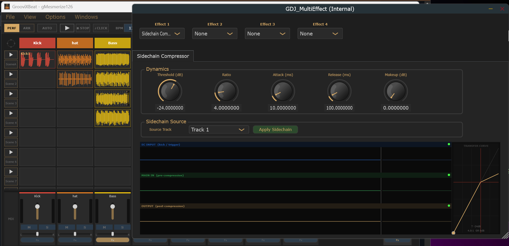

# Sidechain Compressor -- User Manual

The **Sidechain Compressor** lets you duck one track's volume automatically in response to another track's audio signal. The most common use is ducking a bass track every time the kick drum hits, creating a tight rhythmic pumping effect.

---

## How It Works

The sidechain compressor lives inside the **Multi-Effect** plugin, which you add to the track you want to duck (the "target" track). You then tell it which other track to listen to (the "source" track). When the source track's level exceeds the threshold you set, the compressor reduces the target track's volume.

---

## Setup

### Step 1 -- Load your clips

In Performance mode, place your source and target audio on separate tracks. For example:
- **Track 1** -- kick drum (the source that triggers the ducking)
- **Track 2** -- bass (the target that gets ducked)

---

### Step 2 -- Open the FX Chain on the target track

In the mixer strip, click the **Fx** button on the track you want to duck (Track 2, the bass).

---

### Step 3 -- Add the Multi-Effect

In the left panel of the FX Chain dialog, select **Multi-Effect** from the list, then click **Add** to move it into the chain. Click **Apply** to create the effect.

---

### Step 4 -- Open the Multi-Effect editor

Click **Open UI** to open the Multi-Effect editor.

---

### Step 5 -- Configure the Sidechain Compressor

In the **Effect 1** dropdown, select **Sidechain Compressor**. The sidechain settings panel appears.

| Parameter | Starting point | What it does |
|---|---|---|
| **Threshold** | -24 dB | The level from the source track that triggers ducking. Set it around where the kick peaks. |
| **Ratio** | 4:1 to 8:1 | How much ducking is applied. Higher = more pronounced effect. |
| **Attack** | 5-10 ms | How quickly the ducking kicks in after the source triggers. Lower = tighter to the transient. |
| **Release** | 80-150 ms | How quickly the target track returns to full volume. Controls the pumping feel. |
| **Makeup** | +2-4 dB | Compensate if the bass level feels too low overall after ducking. |
| **Source Track** | Track 1 | The track whose signal triggers the ducking. |

---

### Step 6 -- Apply to connect the sidechain

Close the Multi-Effect editor, then return to the FX Chain dialog and click **Apply** again. This second Apply is required to wire the sidechain connection between the source and target tracks.

> **Note:** The sidechain connection is established at Apply time. If you change the Source Track setting in the Multi-Effect editor, you must close the editor and click Apply again in the FX Chain dialog for the change to take effect.

---

## Checking It Works

1. Press **Play** in Arrangement or Performance mode.
2. The bass should audibly duck every time the kick hits.
3. If there is no audible effect, check that the source track has an active audio clip playing and that the Source Track setting matches the correct track number.

---

## Tips

- Start with a slow **Release** (150 ms) to hear the effect clearly, then tighten it down to taste.
- If the ducking sounds too abrupt, increase the **Attack** slightly to let a bit of the transient through before the compression clamps down.
- Use **Makeup** gain to keep the average bass level consistent after compression is applied.
- The Multi-Effect can host multiple effects simultaneously -- you can combine the Sidechain Compressor with other effects in the same FX slot.
